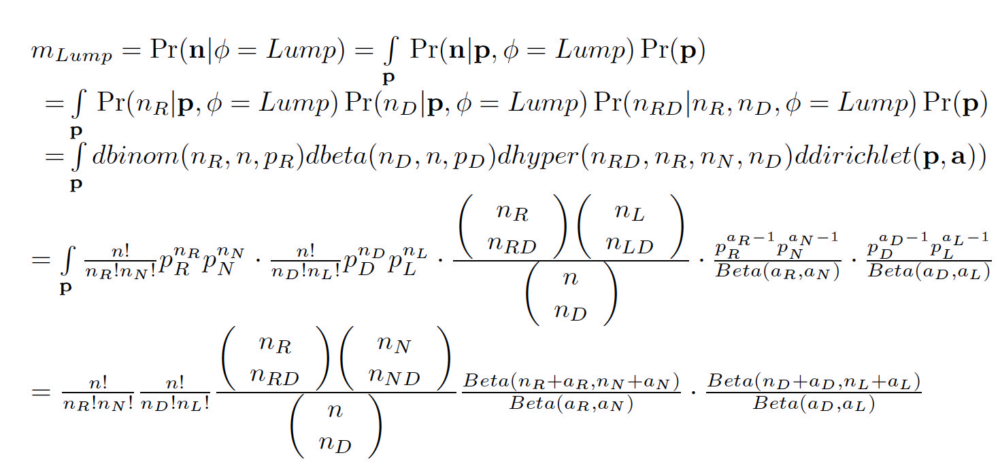

---
output:
  pdf_document: default
  html_document: default
---
We borrow some function names from R to indicate  
the corresponding probability functions   
***dbinom*** (for the binomial distribution) and  
***dhyper*** (for the hypergeometric distribution),  
and a density function ***dbeta*** (for the beta distribution).  

The prior distribution for the probabilities ${\bf{p}}$  
is dirichlet with parameter $\bf{a}$ = $(a_1,a_2,a_3,a_4)$ .   
We take $a_1=a_2=a_3=a_4=1$, a "non-informative"  
(or flat, or "non-opinionated") prior distribution.  
  
Here the dirichlet will factor into a beta distribution  
for $(p_D,P_L)$ and another  beta distribution for $(p_R,P_N)$.  
This is handy here,because the data distribution factors  
into a binomial distribution for $(n_D,n_L)$,   
another binomial distribution for $(n_R,n_N)$,  
and a hypergeometric distribution for $n_RD$.

We let $Beta$ denote the beta distribution normalizer constant,  
defined by

$$
Beta({a_1},{a_2}) = \frac{{Gamma{(a_1)}Gamma{(a_2)}}}{{Gamma\left( {\sum\limits_i {{a_i}} } \right)}} \\\\
=\frac{{{(a_1-1)}!{(a_2-1)}!}}{{\left( {\sum\limits_i {{a_i}}-1 } \right)!}},
$$

where $Gamma$ is the standard gamma function,  
with the convenient property $Gamma(n) = (n-1)!$.

<!-- notice the trick with Beta inverse -->

